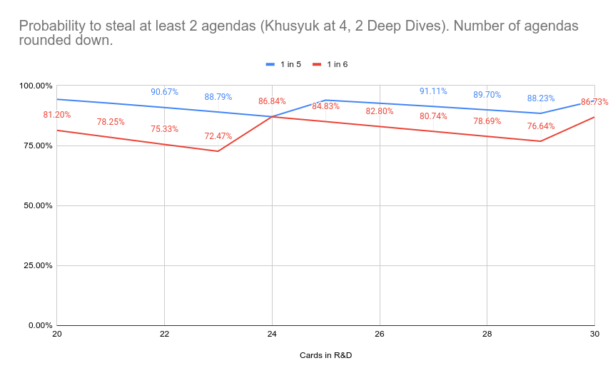
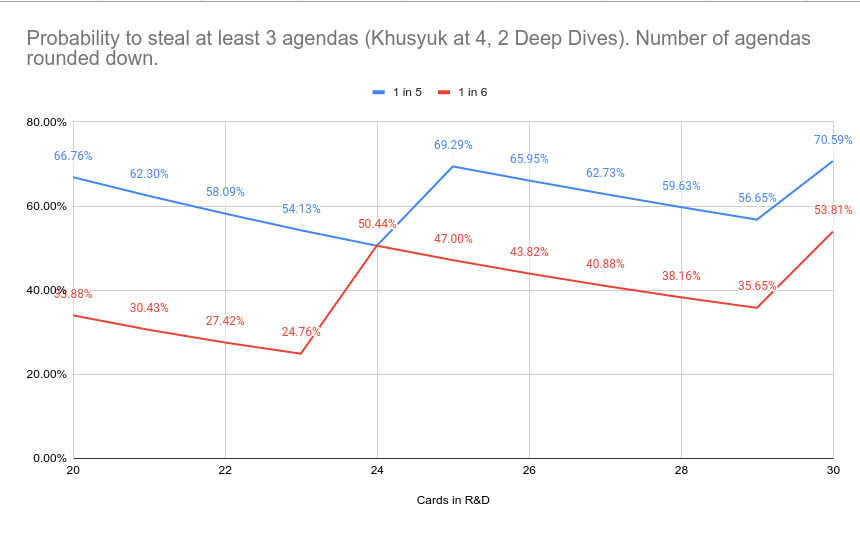

This is a program meant to calculate the probability to steal at least a certain number of agendas using [this Netrunner deck](https://netrunnerdb.com/en/deck/view/4e6fe78a-5844-4e9c-a813-42fd097f7c8c).

It's not much.

---

Here's some graphs:

